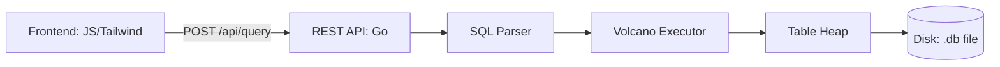

# Simple RDBMS in Go


A lightweight, educational Relational Database Management System built from scratch in Go. This project demonstrates core database concepts including page-based storage, B-Tree indexing, and a Volcano-style query executor.

## Features

- **Page-Based Storage**: 4KB fixed-size pages with a buffer pool for caching.
- **Slotted Page Layout**: Variable-length tuple storage with support for record deletion.
- **B-Tree Index**: O(log n) primary key lookups with unique constraint enforcement.
- **SQL Parser**: Recursive descent parser supporting `SELECT`, `INSERT`, `DELETE`, and basic `JOIN` syntax.
- **Volcano Executor**: Pull-based query execution model supporting Joins and Filters.
- **Interactive REPL**: Command-line interface for real-time SQL queries.
- **REST API**: HTTP endpoint for remote query execution.
- **Management Console**: A modern, glassmorphism-style web dashboard for data exploration, real-time telemetry, and SQL execution.

## Installation

### Clone the Repository
```bash
git clone https://github.com/benkivuva/my-rdbms.git
cd my-rdbms
```

### Prerequisites

* Go 1.21 or higher
* Git

## Project Structure

```
my-rdbms/
├── cmd/
│   ├── rdbms/              # Main application
│   │   ├── main.go         # Entry point
│   │   └── repl.go         # Interactive shell logic
│   └── btree_test/         # B-Tree verification utility
├── internal/
│   ├── storage/            # Disk and memory management
│   │   ├── page.go         # Page definition (4KB)
│   │   ├── disk_manager.go # File I/O operations
│   │   ├── buffer_pool.go  # LRU Page cache
│   │   ├── slotted_page.go # Tuple layout with Delete support
│   │   ├── table_heap.go   # Linked list of pages
│   │   └── rid.go          # Record identifier
│   ├── index/              # B-Tree implementation
│   │   ├── btree.go        # Tree operations
│   │   └── btree_node.go   # Node structure
│   ├── sql/                # SQL parsing
│   │   ├── lexer.go        # Tokenizer
│   │   ├── parser.go       # AST builder with JOIN support
│   │   └── ast.go          # Statement definitions
│   └── executor/           # Query execution
│       ├── executor.go     # Executor interface
│       ├── nodes.go        # SeqScan, Insert, Filter, Delete
│       └── join_executor.go # Nested Loop Join with iterator reset
├── public/                 # Web assets
│   └── index.html          # Management Console (Tailwind/JS)
├── go.mod
└── README.md
```

## Quick Start

### Run the REPL

```bash
# Clean start (deletes previous DB file)
rm my_rdbms.db && go run cmd/rdbms/*.go
```

Example session:

```sql
db> INSERT INTO users VALUES (1, 'Ben')
INSERT OK
db> INSERT INTO orders VALUES (101, 1, 500)
INSERT OK
db> SELECT * FROM users JOIN orders ON users.id = orders.user_id
----------------
[1 Ben 101 1 500]
(1 rows)
db> exit
```

### Run the Server & UI

To access the Management Console, start the RDBMS in server mode:

```bash
# Start the HTTP server on :8080
go run cmd/rdbms/*.go server
```

Then open your browser to [http://localhost:8080](http://localhost:8080).

## Console Preview

> [!NOTE]
> *Integrated Management Console featuring Data Explorer and Live Telemetry.*


## Architecture Overview

### Request Flow



### Data Layout (Binary)

The engine uses a fixed primary-key schema for performance and indexing efficiency:

| Offset | Length | Type | Description |
| --- | --- | --- | --- |
| 0 | 4 Bytes | `Uint32BE` | **Primary Key**: Unique Record Identified |
| 4 | Variable | `VARCHAR` | **Payload**: Raw string bytes |

> [!TIP]
> This binary format allows the `B-Tree` to perform extremely fast comparisons on the first 4 bytes of every heap slot without full string deserialization.

### Storage Layer

The storage layer manages persistence through a hierarchy of abstractions:

* **DiskManager**: Handles raw file I/O for 4KB pages.
* **BufferPool**: Caches frequently accessed pages in memory using LRU.
* **SlottedPage**: Organizes variable-length tuples; manages record "tombstones" for deletion.
* **TableHeap**: Links multiple pages together for table storage.

### Index Layer

B-Tree index provides efficient key lookups:

* Leaf nodes store (key, RID) pairs.
* Automatic leaf splitting when nodes reach capacity.
* **Enforcement**: Validates unique constraints during the insertion phase.

### Execution Layer

Volcano-style pull model:

* Each operator implements `Init()`, `Next()`, and `Close()`.
* **Join Logic**: Implements a Simple Nested Loop Join (SNJL) that rewinds the inner child iterator for every row of the outer child.
* **Telemetry Integration**: The execution lifecycle is hooked into the telemetry pipeline, allowing the Management Console to trace physical row-pulls and join predicate evaluations in real-time.

## Supported SQL

| Statement | Syntax |
| --- | --- |
| **INSERT** | `INSERT INTO table VALUES (value1, value2, ...)` |
| **SELECT** | `SELECT * FROM table [JOIN table2 ON ...] [WHERE ...]` |
| **DELETE** | `DELETE FROM table [WHERE ...]` |
| **CREATE TABLE** | `CREATE TABLE name (col1 INT, col2 VARCHAR)` |

## Limitations

* No transaction support (no ACID guarantees).
* No concurrent query execution (single-threaded access).
* B-Tree index structure is not persisted across restarts (re-indexing required).
* Single table per database file.

##  Roadmap

### Phase 1: Persistence & Reliability

* [ ] **Catalog Persistence**: Store table schemas and B-Tree root IDs in a dedicated Metadata Page.
* [ ] **B-Tree Serialization**: Implement `Serialize/Deserialize` to ensure indexes survive restarts.
* [ ] **Write-Ahead Logging (WAL)**: Redo-logging for crash recovery.

### Phase 2: SQL Enhancements

* [x] **Delete & Update**: Basic support implemented via RID identification.
* [x] **Joins**: Nested Loop Join support completed.
* [ ] **Advanced Joins**: Hash Join implementation for better performance.

### Phase 3: Interface & Experience

* [x] **Web-based Control Plane**: High-fidelity dashboard for DB management.
* [x] **Engine Telemetry**: Live tracing of I/O and executor events.
* [ ] **Query Optimizer**: Rule-based optimization for predicate pushdown.

## License

MIT License
